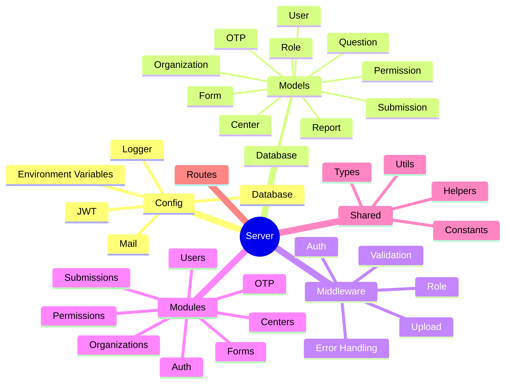

# Server Architecture Mindmap

This document outlines the architecture and file structure of the `main/server` directory.

## High-Level Architecture

## Directory Structure

* `main/server/`
    * `.env`
    * `package-lock.json`
    * `package.json`
    * `seed.mjs`
    * `src/`
        * `app.mjs`
        * `server.mjs`
        * `config/`
            * `db.mjs`
            * `env.mjs`
            * `jwt.mjs`
            * `logger.mjs`
            * `mail.mjs`
        * `database/`
            * `index.mjs`
            * `models/`
                * `Center.model.mjs`
                * `Form.model.mjs`
                * `OTP.model.mjs`
                * `Organization.model.mjs`
                * `Permission.model.mjs`
                * `Question.model.mjs`
                * `Report.model.mjs`
                * `Role.model.mjs`
                * `Submission.model.mjs`
                * `User.model.mjs`
        * `middleware/`
            * `auth.middleware.mjs`
            * `error.middleware.mjs`
            * `role.middleware.mjs`
            * `upload.middleware.mjs`
            * `validation.middleware.mjs`
        * `modules/`
            * `auth/`
                * `auth.controller.mjs`
                * `auth.repository.mjs`
                * `auth.routes.mjs`
                * `auth.service.mjs`
                * `auth.types.mjs`
                * `auth.validation.mjs`
            * `centers/`
                * `center.controller.mjs`
                * `center.repository.mjs`
                * `center.routes.mjs`
                * `center.service.mjs`
                * `center.validation.mjs`
            * `forms/`
                * `form.controller.mjs`
                * `form.repository.mjs`
                * `form.routes.mjs`
                * `form.service.mjs`
                * `form.types.mjs`
                * `form.validation.mjs`
            * `organizations/`
                * `organization.controller.mjs`
                * `organization.repository.mjs`
                * `organization.routes.mjs`
                * `organization.service.mjs`
                * `organization.validation.mjs`
            * `otp/`
                * `otp.controller.mjs`
                * `otp.repository.mjs`
                * `otp.routes.mjs`
                * `otp.service.mjs`
            * `permissions/`
                * `permission.routes.mjs`
                * `permission.service.mjs`
                * `role.service.mjs`
            * `submissions/`
                * `submission.controller.mjs`
                * `submission.repository.mjs`
                * `submission.routes.mjs`
                * `submission.service.mjs`
            * `users/`
                * `user.controller.mjs`
                * `user.repository.mjs`
                * `user.routes.mjs`
                * `user.service.mjs`
                * `user.types.mjs`
                * `user.validation.mjs`
        * `routes/`
            * `index.mjs`
        * `shared/`
            * `constants/`
                * `permissions.mjs`
                * `roles.mjs`
                * `status.mjs`
            * `helpers/`
                * `comparePassword.mjs`
                * `generateOtp.mjs`
                * `generateToken.mjs`
                * `hashPassword.mjs`
            * `types/`
                * `api.types.mjs`
                * `express.types.mjs`
            * `utils/`
                * `apiResponse.mjs`
                * `date.mjs`
                * `logger.mjs`
                * `pagination.mjs`
