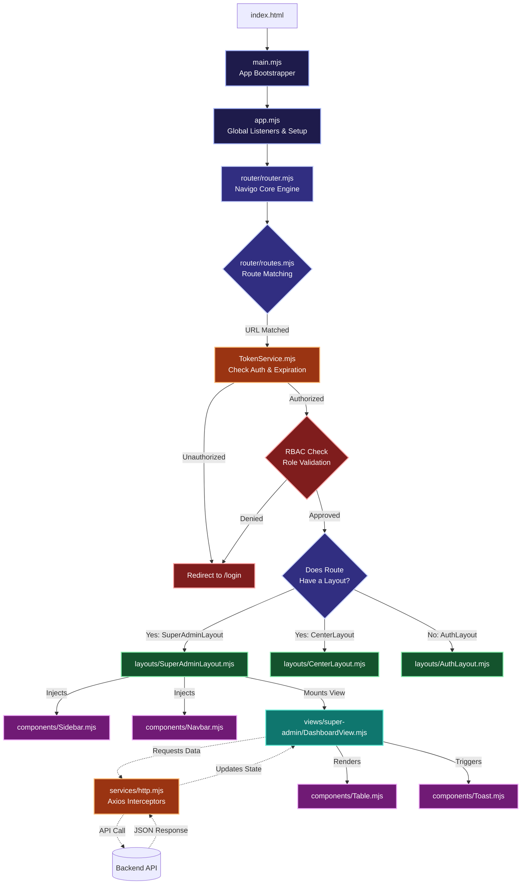
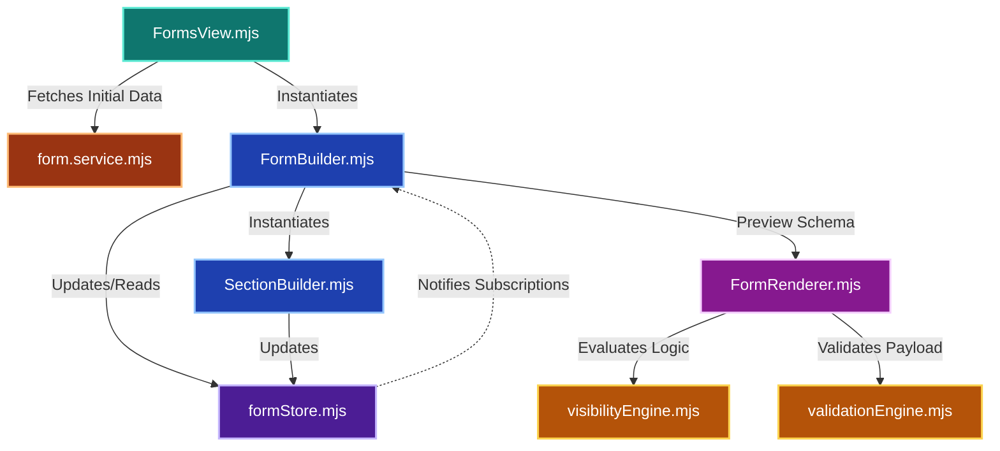

# Frontend Workflow Architecture

This document maps out the core request lifecycle and how the frontend architecture handles routing, authentication, component injection, and rendering.

## Core Flow Diagram

### Flow Breakdown:
1. **Entry Point:** The browser hits `index.html` which loads `main.mjs`. `main.mjs` imports `app.mjs` to initialize global events, and then triggers the router.
2. **Routing & Guards:** `router.mjs` intercepts the URL and checks `routes.mjs` for a match. It immediately calls `TokenService.mjs` to verify if the user is authenticated and has the correct role (`allowedRoles`).
3. **Layout Shell:** If the user is authorized, the Router dynamically loads the assigned `Layout` (e.g., `SuperAdminLayout.mjs`). The layout renders the `Sidebar` and `Navbar` components into the DOM.
4. **View Mounting:** The layout creates a container (`<main id="layout-content">`) and dynamically mounts the target `View` (e.g., `DashboardView.mjs`) inside of it.
5. **Data Fetching:** The View initiates an asynchronous API call through `http.mjs`. The `http` service automatically attaches the JWT token to the headers.
6. **UI Feedback:** While waiting for data, the View renders a Skeleton UI or triggers `Loader.mjs`. Upon success or failure, it uses `Toast.mjs` to notify the user.
7. **Rendering:** Finally, the View updates its DOM with the fetched data, often injecting reusable components like `Table.mjs`.

## Dynamic Form Engine Workflow

This workflow represents Phase 6 and dictates how forms are created, managed, and executed within the application.

### Form Flow Breakdown:
1. **View Instantiation:** The user visits the forms page (`FormsView.mjs`), which fetches the existing form schemas from the backend using `form.service.mjs`.
2. **Builder Initialization:** Clicking "Edit Schema" loads the schema into the central state manager (`formStore.mjs`) and mounts `FormBuilder.mjs`.
3. **State Management & Editing:** `FormBuilder.mjs` orchestrates the UI, delegating question logic to `SectionBuilder.mjs`. Any interaction updates `formStore.mjs`, which utilizes a Pub/Sub pattern to trigger an immediate re-render of the Builder UI.
4. **Live Preview Rendering:** The builder can summon `FormRenderer.mjs` for a live preview. The renderer reads the exact JSON state from `formStore.mjs`.
5. **Rules Engine Evaluation:** As the user interacts with the rendered form, `FormRenderer.mjs` continuously invokes `visibilityEngine.mjs` to conditionally hide/show questions, and utilizes `validationEngine.mjs` to strictly validate the final payload payload before submission.
